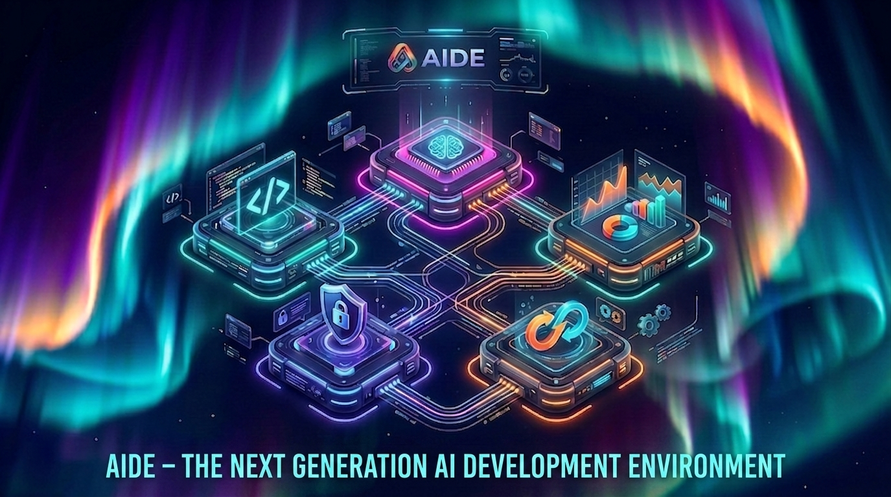
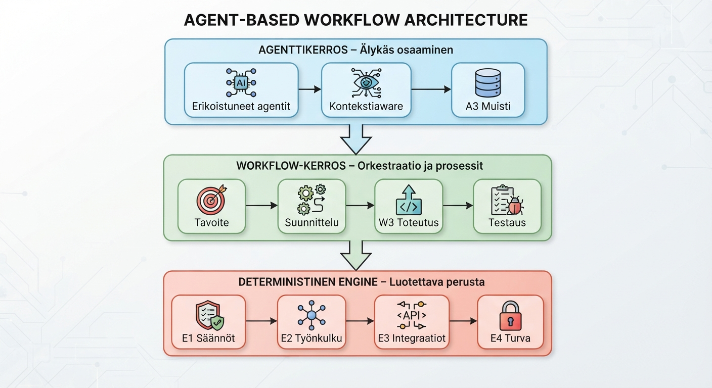
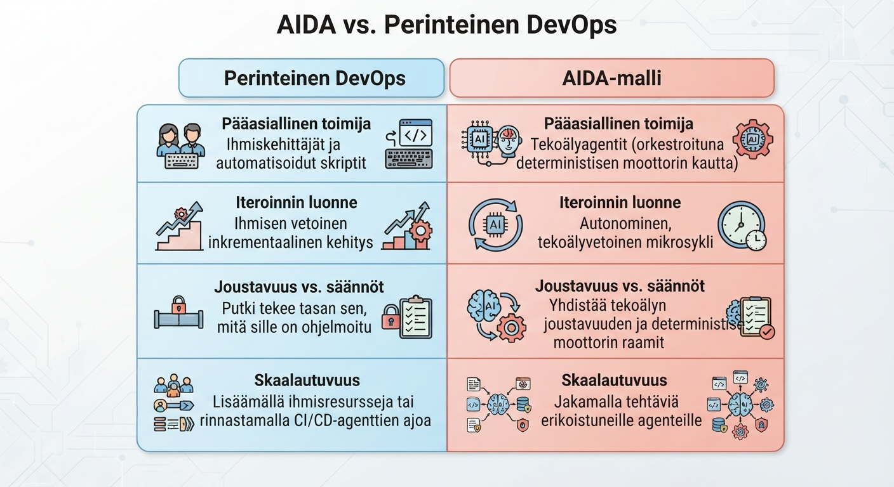
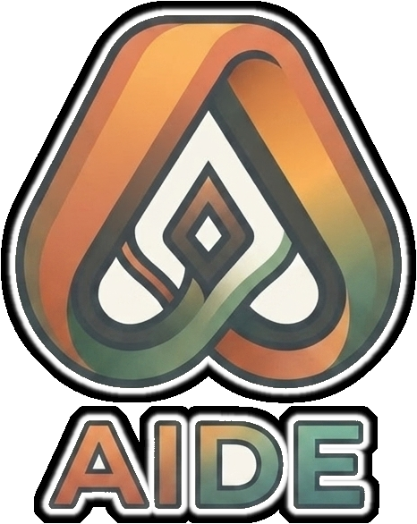

  

# AI Development Environment - AIDE

**AIDE** (AI Development Environment) on **agenttipohjainen ohjelmistokehitysympäristö**, joka yhdistää perinteisen ohjelmistotuotannon rakenteet moderniin tekoälyavustamiseen. Se ei ole yksittäinen agentti — se on kokonainen järjestelmä, jossa eri roolit yhteistoimivat. 

## AIDA‑arkkitehtuuri - Kolme tasoa
 

  

### Agenttikerros – Älykäs osaaminen
Tekoälyagentit muodostavat AIDA:n ylimmän tason. Ne analysoivat, suunnittelevat ja tuottavat sisältöä projektin tavoitteiden mukaisesti. Agentit ovat kontekstia ymmärtäviä ja oppivia, mutta niiden toiminta ei ole koskaan villiä — alemmat tasot pitävät ne kurissa.

### Workflow‑kerros – Orkestraatio ja prosessit
Tämä taso ohjaa koko ohjelmistokehityksen elinkaarta vaihe vaiheelta. Se varmistaa, että työ etenee järjestelmällisesti: **Analyze → Plan → Implement → Test → Review → Document**.

Workflow toimii kuin projektin liikennevalo: seuraavaan vaiheeseen ei siirrytä ennen kuin laatuportit täyttyvät.

### Deterministinen Engine – Luotettava perusta
Arkkitehtuurin alin taso on AIDA:n turvaverkko. Se pakottaa kaiken agenttien tuottaman materiaalin sääntöjen, validointien, testien ja turvaskannausten läpi. Moottori takaa, että samasta syötteestä syntyy aina sama, turvallinen ja ennustettava lopputulos — ilman hallusinaatioita, hyppyjä prosessissa tai tietoturvariskejä.

## AIDA vs. Perinteinen DevOps

  

---
## Tältä sivustolta löydät

- Asennus- ja käyttöohjeet projektin käynnistykseen
- Selitykset jokaiselle agentille ja workflowlle
- Esimerkeja toteutuksista
- Tekniset speksit ja moduulikuvaukset

---

## Haluatko oppia lisää?

- [Asennus](getting-started/installation.md)
- [Agentit](agents/overview.md)
- [Workflowt](workflows/base-workflow.md)
- [Arkkitehtuuri](architecture/overview.md)

 
---

> Tämä dokumentaatiosivusto päivittyy **automatisesti**, kun AIDE:n lähdekoodi muuttuu.
